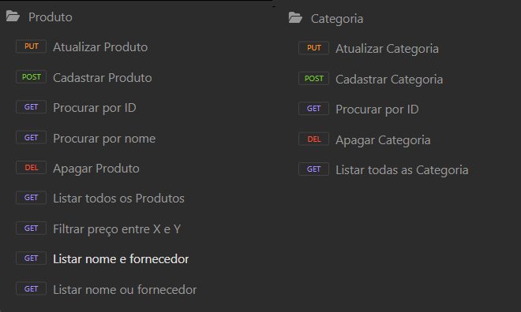

<h1 align="center"> API Farmacia </h1>

  
Projeto desenvolvido no Framework Spring durante o Bootcamp Desenvolvedor Java Fullstack da Generation Brasil.

Criação da API para um sistema farmacêutico, caracterizado pela implementação de vários filtros personalizados.

<h2> 🛠 Tecnologias: </h2>

As seguintes tecnologias foram usadas na construção do projeto:

### 💬 Assuntos abordados:

- Sistemas web e recursos
- Cliente/servidor, HTTP, JSON
- Padrão Rest para API web
- Estruturação de projeto Spring Rest
- Entidades e Mapeamento Objeto-Relacional (ORM)
- Padrão camadas
- Controller, Service, Repository

## EndPoints:

Abaixo consta os recursos da API:

## Dependências utilizadas no projeto:

| Dependência | Descrição |
| --- | --- |
| **Spring Web**            | Essa dependência fornece todas as bibliotecas necessárias para criar um projeto WEB e trabalhar com o protocolo HTTP/HTTPS. |
| **Spring Boot Dev Tools** | Permite a atualização do projeto em tempo real durante o processo de Desenvolvimento da aplicação. |
| **Validation**            | Fornece um conjunto de anotações que permitem validar os Atributos das Classes da Camada Model. |
| **Spring Data JPA**       | Java Persistence API (JPA) é uma Biblioteca que armazena e recupera Objetos, que foram persistidos (armazenados) em um Bancos de Dados.      |
| **MySQL Driver**          | Responsável pela conexão entre nossa aplicação e o Banco de Dados MySQL.|

<h2> Autor: </h2>

Feito com ❤️ por Giselle Souza. 👋
 

